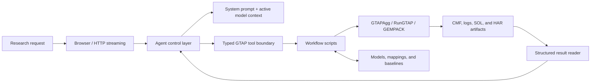

# GTAP Agent

GTAP Agent is a local, tool-grounded agent for constructing, solving, and interpreting reproducible GTAP experiments. It connects a conversational model to a restricted set of typed operations for aggregation, baseline selection, closure adjustment, shock construction, RunGTAP/GEMPACK execution, and structured result retrieval.

The project is defined by this controlled analysis architecture—not by one database year, one aggregation, or one historical shock path. The repository includes a GTAP 10A 2014 source database, a bundled 10-region-by-10-sector model, and a registered 2024 baseline as a concrete runnable profile. The 2014-to-2024 update is optional profile preparation, not the conceptual center of GTAP Agent.

## Why an Agent Layer?

A GTAP experiment is more than a prompt followed by a number. It requires a consistent chain of modeling decisions:

```text
aggregation
  -> input baseline
  -> model closure
  -> shocks
  -> solve
  -> solve report
  -> targeted result retrieval
```

Language models are useful for translating a research question into that chain, but they should not invent GTAP variables, dimensions, files, or results. GTAP Agent therefore separates natural-language reasoning from model execution:

- the model decides which registered operation is appropriate;
- tool schemas constrain the decisions it can express;
- Python scripts validate model state and generate auditable artifacts;
- RunGTAP/GEMPACK performs the numerical solve;
- the Agent answers from returned files and structured results.

## Architecture



| Layer | Responsibility | Main location |
| --- | --- | --- |
| Interface | Chat UI, streaming responses, and execution trace | `web/index.html`, `web/app.js` |
| Transport | Static serving and JSON/NDJSON endpoints | `web/server.py` |
| Agent control | Sessions, system prompt, model context, tool loop, and response synthesis | `web/agent.py` |
| Tool boundary | Named operations with JSON schemas and validated handlers | `web/agent.py` |
| Workflow | Aggregation, CMF construction, solving, and result extraction | `scripts/` |
| GTAP runtime | Project-local GTAPAgg, RunGTAP, GEMPACK programs, and models | `runtime/` |
| Audit trail | Mappings, manifests, CMFs, logs, solutions, HAR files, and reports | `config/`, `asset/`, `result/` |

The web server exposes no arbitrary shell tool. Each Agent operation maps to a known script and a validated parameter structure. RunGTAP execution is serialized because the bundled runtime uses a shared work directory.

## Agent Toolchain

| Agent tool | Role in the workflow | Main implementation |
| --- | --- | --- |
| `aggregate_gtap_model` | Rebuild the bundled model when explicitly requested or missing | Script 01 |
| `aggregate_custom_gtap_model` | Make local changes to regional or sectoral aggregation | Script 01 |
| `fetch_observed_data` | Prepare external calibration data and aggregation mappings | Script 04 |
| `build_2024_baseline_update` | Optional bundled-profile historical preparation | Script 05 |
| `modify_gtap_closure` | Apply a non-empty approved local closure patch | `modify_gtap_closure.py` |
| `modify_shock_cmf` | Construct structured GTAP shocks on an explicit baseline | Script 06 |
| `run_gtap_scenario` | Solve one explicit CMF and automatically return a solve/result report | Script 03 + script 07 |
| `read_gtap_results` | Query additional variables, headers, sources, or dimensions | Script 07 |

These tools are composable; their numeric filenames do not prescribe a mandatory end-to-end sequence. Routine policy analysis normally needs only shock construction and solve. Aggregation, observed-data retrieval, and historical baseline construction are preparation operations.

## Modeling Principles

### Aggregation is active model context

Natural-language countries and products must resolve to dimensions that actually exist in the selected model. A request to retain the current aggregation does not authorize rebuilding it. A custom aggregation moves only the requested original GTAP members; unspecified members retain their existing assignments.

Changing aggregation changes model dimensions. Dimension-bound calibration data and registered baselines cannot be silently reused with a new model.

### The baseline is explicit

Scenario tools never infer an ambiguous “base.” The bundled profile exposes two identifiers:

- `original_2014`: the selected model's original `basedata.har` and `baserate.har`;
- `registered_2024`: the model-bound baseline recorded in `asset/default_baseline.json`.

The identifiers describe concrete model states rather than an implicit global default. The current tool contract exposes these two IDs; extending the project with another registered state requires an explicit profile/configuration change.

### Standard closure is the default path

An unchanged standard policy closure requires no closure-tool call. `modify_gtap_closure` is reserved for supported, non-empty local swaps, currently regional GDP-target/TFP and fixed-investment variants. Arbitrary closure text is not exposed to the Agent.

### Shock permissions are broad but structured

The Agent selects from a whitelist of GTAP variables covering taxes, population, factor supplies, production technologies, import-augmenting technology, international shipping technology, and closure-sensitive targets.

Each code has its own schema branch and exact dimensions. For example:

- `tms(commodity, exporter, importer)` is a bilateral import-tax shock;
- `aoall(sector, region)` is output technology for one sector in one region;
- `atd(importer)` is destination-specific international-shipping technology.

Unrelated dimensions, empty selectors, raw CMF statements, and unknown codes are rejected. Multiple compatible shocks for one experiment are submitted together.

### Solve and result retrieval are grounded in artifacts

Every downstream operation receives the exact artifact path returned by the previous tool. The Agent does not reconstruct CMF or result-directory names.

A successful solve automatically returns baseline and closure context, resolved shocks, solve status, accuracy, warnings, output descriptions, and default economic indicators. `read_gtap_results` is used only for targeted follow-up queries. It reads one run at a time; comparisons are made by reading the requested runs independently.

## Bundled Runnable Profile

| Setting | Bundled value |
| --- | --- |
| Source database | GTAP 10A, reference year 2014 |
| Default aggregated model | `gtap2015_10x10` |
| Registered policy baseline | 2024 |
| Registered data | `asset/basedata_2024.har`, `asset/baserate_2024.har` |
| Baseline metadata | `asset/default_baseline.json` |
| Model API | OpenRouter, default `openai/gpt-5.6-luna` |

The registered 2024 baseline was produced through a historical update of the source database. That recipe uses observed macro targets and a GDP/TFP closure swap. It is useful preparation for the bundled profile but is not automatically run for normal policy requests.

The legacy `02_prepare_2015_economy_shocks.py` program remains only as a smoke test of the old call chain.

## Benchmarking

The repository includes a reproducible benchmark comparing the same model and research prompts under two conditions:

- `agent_tools`: the model can construct and solve experiments through GTAP Agent;
- `no_tools`: the model must estimate from general reasoning, clarify genuine experiment ambiguity, or reject unsupported model extensions.

Runs are recorded in SQLite with prompts, prompt hashes, model identifiers, tool calls, responses, artifact paths, latency, and token usage. Solver output is not automatically accepted as gold: aggregation, baseline, closure, and shock semantics must first match an expert reference plan.

See [benchmark/README.md](benchmark/README.md) for the evaluation design.

## Quick Start

Requirements:

- Windows for the bundled native GTAP runtime;
- Python 3.10 or newer;
- an OpenRouter API key for the conversational interface only.

```powershell
python -m pip install -r requirements.txt
python scripts\00_verify_local_runtime.py
python -m unittest discover -s tests -v
python web\server.py --host 127.0.0.1 --port 8765
```

Then open `http://127.0.0.1:8765/`.

The API key is read from `OPENROUTER_API_KEY`, falling back to line 2 of `scripts/key.txt`. `OPENROUTER_MODEL` and `OPENROUTER_BASE_URL` can override the default service configuration.

`New Task` in the web interface creates a fresh Agent session and clears both conversation history and the execution trace. Generated GTAP artifacts remain on disk for audit and later result queries.

## Repository Layout

```text
GTAPAgent/
  asset/                 source and registered baseline assets
  benchmark/             tool/no-tool evaluation framework and SQLite log
  config/aggregations/   reusable aggregation mappings and metadata
  runtime/
    gtapagg/             aggregation runtime and source project
    rungtap/             RunGTAP programs, models, and shared work area
    gempack/             conversion utilities
  scripts/               CLI workflow and shared implementation modules
  result/                generated CMFs, logs, solutions, HAR files, and reports
  tests/                 workflow, Agent, schema, and UI regression tests
  web/                   browser UI, server, Agent prompt, and tool schemas
```

Detailed documentation:

- [scripts/README.md](scripts/README.md): CLI contracts, arguments, artifacts, and variable scopes
- [web/README.md](web/README.md): web transport, sessions, streaming, and frontend behavior
- [benchmark/README.md](benchmark/README.md): benchmark protocol and immutable logging
- [runtime/README.md](runtime/README.md): bundled runtime layout and overrides
- [config/aggregations/README.md](config/aggregations/README.md): aggregation format and constraints

## Limits and Research Use

- The bundled native runtime is Windows-specific and is not a GTAP/GEMPACK distribution.
- Economic detail cannot exceed the active regional, sectoral, and factor aggregation.
- The bundled historical update is an approximate database update, not a recursive-dynamic projection or formal historical decomposition.
- External calibration coverage and tariff concordance remain incomplete.
- Web sessions are in-memory and process-local.
- Publication-quality work still requires expert review of aggregation, baseline construction, closure, shock semantics, convergence, and interpretation.

## License and Data

Project code is released under the repository `LICENSE`. GTAP databases, GEMPACK/RunGTAP components, and related runtime files may be governed by separate licenses. Do not publish private GTAP/GEMPACK data or license files.
