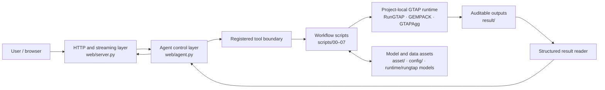

# GTAP Agent

GTAP Agent is a local, agent-driven workspace for building, running, and interpreting reproducible GTAP scenarios. It connects a conversational interface to a restricted set of workflow tools for model aggregation, data preparation, CMF construction, RunGTAP/GEMPACK execution, and structured result analysis.

The project is defined by this **controlled analysis architecture**, not by a particular database year or shock. The repository currently includes a ready-to-run profile built from the GTAP 10A 2014 database, a 10-region-by-10-sector aggregation, and a registered 2024 policy baseline. That profile is a bundled default and demonstration path; it is not the overall framing of GTAP Agent.

## Architecture



The architecture separates six responsibilities:

| Layer | Responsibility | Main location |
| --- | --- | --- |
| Interaction | Chat UI, HTTP endpoints, and NDJSON streaming | `web/index.html`, `web/app.js`, `web/server.py` |
| Agent control | Conversation state, prompt construction, tool selection, retries, and response synthesis | `web/agent.py` |
| Tool boundary | Validated, named operations instead of arbitrary shell access | Tool schemas and handlers in `web/agent.py` |
| Workflow | Aggregation, observed-data preparation, CMF generation, solving, and result extraction | `scripts/` |
| GTAP execution | Project-local RunGTAP, GEMPACK utilities, GTAPAgg, and model directories | `runtime/` |
| Artifacts | Inputs, mappings, registered baselines, logs, CMFs, solutions, and summaries | `asset/`, `config/`, `result/` |

### Control flow

For a typical request, the Agent:

1. Interprets the requested experiment against the **active** regional and sectoral aggregation.
2. Selects only the registered tool or tools needed for the request.
3. Produces an auditable scenario specification and CMF without modifying the source CMF.
4. Runs RunGTAP only when the user asks to solve the scenario.
5. Reads `.sol`, HAR, logs, and summary files into structured JSON when results must be interpreted.
6. Answers from tool output and artifact paths rather than inventing model results.

This separation allows the CLI workflow to be used without the web Agent, and allows the Agent to orchestrate GTAP without exposing unrestricted command execution.

## Core Capabilities

- Build the default or a custom GTAPAgg regional/sectoral aggregation.
- Fetch, cache, and standardize observed GDP, population, and tariff data.
- Construct a historical/baseline-update CMF for a chosen supported model profile.
- Create policy CMFs from structured tariff, population, factor-endowment, and productivity modifications.
- Execute scenarios with the bundled RunGTAP/GEMPACK runtime.
- Read solve status, accuracy, GDP, welfare, trade, sector output, HAR tables, and solution variables.
- Preserve resolved scenario JSON/CSV, generated CMFs, logs, solution files, and summaries for audit and replication.
- Normalize natural-language country and commodity references to the active GTAP aggregation.

## Components and Boundaries

### Web and Agent layer

`web/server.py` is intentionally limited to static-file serving, HTTP handling, and JSON/NDJSON transport. `web/agent.py` owns the LLM client, in-memory sessions, dynamic aggregation context, tool loop, tool schemas, and execution handlers.

The Agent can call only these registered operations:

| Agent tool | Workflow role | Script |
| --- | --- | --- |
| `aggregate_gtap_model` | Rebuild the bundled default aggregation | `01_aggregate_gtap10a_2014_to_10x10.py` |
| `aggregate_custom_gtap_model` | Create an independent custom aggregation and model | `01_aggregate_gtap10a_2014_to_10x10.py` |
| `fetch_observed_data` | Fetch/cache data and generate active mapping tables | `04_fetch_observed_calibration_data.py` |
| `build_2024_baseline_update` | Generate baseline-update targets and CMFs | `05_build_2024_baseline_update.py` |
| `modify_shock_cmf` | Resolve structured changes and write a policy CMF | `06_apply_policy_shock_modifications.py` |
| `run_gtap_scenario` | Solve a specified CMF and collect outputs | `03_run_rungtap_scenario.py` |
| `read_gtap_results` | Query and summarize collected GTAP results | `07_read_gtap_results.py` |

Tool execution is serialized because RunGTAP uses a shared local work directory. User-provided paths are constrained to the project workspace, custom aggregation does not overwrite an existing model by default, and baseline registration must be requested explicitly.

### Workflow layer

The numbered scripts are composable entry points, not a requirement that every request run the entire sequence:

```text
00  verify local runtime
01  prepare an aggregation/model                       [when needed]
04  fetch and standardize observed data                [when needed]
05  construct a baseline update                        [when needed]
03  solve any generated CMF
06  construct a structured policy scenario
03  solve the policy scenario
07  read or query results
```

Script `02_prepare_2015_economy_shocks.py` is retained as a legacy smoke test and is not part of the main architecture.

Reusable implementation is factored into:

- `scripts/gtap_runtime.py`: portable runtime and executable discovery.
- `scripts/gtap_aggregation.py`: mapping parsing, customization, and validation.
- `scripts/gtap_observed_data.py`: data retrieval, caching, standardization, and GTAP mapping.

### Runtime and artifact layer

The repository resolves bundled tools before consulting the host `PATH`:

| Component | Default path |
| --- | --- |
| RunGTAP and model workspaces | `runtime/rungtap/` |
| GEMPACK conversion utilities | `runtime/gempack/` |
| GTAPAgg and aggregation project | `runtime/gtapagg/` |
| Source and registered model assets | `asset/` |
| Custom aggregation definitions | `config/aggregations/` |
| Generated and collected artifacts | `result/` |

Optional environment overrides are supported through `GTAP_RUNGTAP_DIR` or `RUNGTAP_DIR`, `GEMPACK_DIR`, `GTAPAGG_DIR`, `GTAPAGG_PROJECT_DIR`, `GTAPAGG_MAPPING`, `GTAPAGG_INPUT_DIR`, and `GTAP_PKG_FILE`.

## Bundled Default Profile

The checked-in workspace provides one concrete profile so that the architecture can be exercised without assembling a GTAP runtime from scratch:

| Profile setting | Bundled value |
| --- | --- |
| Source database | GTAP 10A, reference year 2014 |
| Aggregated model | `gtap2015_10x10` |
| Registered policy baseline | 2024 |
| Baseline data | `asset/basedata_2024.har` |
| Baseline tariff rates | `asset/baserate_2024.har` |
| Baseline metadata | `asset/default_baseline.json` |
| Agent model service | DeepSeek-compatible chat-completions endpoint |
| Interface and canonical identifiers | English |

In this profile, the 2024 baseline was produced by updating the 2014 database with observed macro data. Routine bundled examples therefore start from 2024. This is an implementation default, not a claim that all GTAP Agent projects must use a 2014-to-2024 update.

The current scripts still contain profile-specific names and guardrails—most visibly `build_2024_baseline_update` and policy `base_year` choices of 2014 or 2024. Supporting another database vintage or policy baseline may require a new model profile and small workflow extensions, but it does not change the layered architecture above.

## Quick Start

### Requirements

- Windows, because the bundled GTAP tools are Windows executables.
- Python 3 available as `python`.
- A DeepSeek API key only when using the conversational web Agent; the CLI workflow does not need an LLM key.

Verify the bundled runtime from the project root:

```powershell
python scripts\00_verify_local_runtime.py
```

Run the automated tests:

```powershell
python -m unittest discover -s tests -v
```

### Start the web Agent

The API key is loaded from `DEEPSEEK_API_KEY`, falling back to the local `scripts/key.txt` file. `DEEPSEEK_MODEL` can override the configured model name.

```powershell
python web\server.py --host 127.0.0.1 --port 8765
```

Then open `http://127.0.0.1:8765/`.

Opening `web/index.html` directly shows only a static preview. Agent requests and local workflow tools require the Python server.

## Scenario Lifecycle

GTAP Agent distinguishes model preparation from routine scenario analysis.

### 1. Prepare a model profile

Preparation is required when the aggregation, observed dataset, source database, or registered baseline changes. It is not repeated for every policy scenario.

For the bundled profile, the relevant commands are:

```powershell
python scripts\01_aggregate_gtap10a_2014_to_10x10.py
python scripts\04_fetch_observed_calibration_data.py --skip-wits
python scripts\05_build_2024_baseline_update.py --write-all-cmfs
python scripts\03_run_rungtap_scenario.py `
  --cmf result\05_baseline_update\cmf\baseline_update_2014_to_2024.cmf `
  --result-dir result\03_run_baseline_2024 `
  --set-as-default-baseline
```

The aggregation and observed-data steps should be run only when their outputs are missing or need to be rebuilt. `--set-as-default-baseline` registers a successfully solved model state for later policy scenarios; it must not be used for a policy run.

### 2. Define a policy scenario

Structured input is resolved against the active aggregation and written to a new CMF plus audit files. For example, using the bundled profile:

```powershell
$spec = '{"scenario_name":"China US soybean tariff 20","modifications":[{"type":"bilateral_import_tariff","importer":"China","exporter":"United States","commodity":"soybeans","tariff_percent":20,"rate_mode":"target_rate"}]}'
python scripts\06_apply_policy_shock_modifications.py --spec-json $spec
```

Supported modification types are:

- `bilateral_import_tariff`
- `regional_population`
- `regional_endowment`
- `regional_productivity`

For tariffs, `target_rate` sets the requested ad valorem rate after conversion from baseline `RTMS` to the GTAP `tms` tax-power change. `rate_change` applies a percentage-point change, while `power_change` applies the tax-power shock directly.

### 3. Solve the scenario

```powershell
$policyCmf = Get-ChildItem result\06_policy_modifications\cmf\policy_2024__*.cmf |
  Sort-Object LastWriteTime -Descending |
  Select-Object -First 1 -ExpandProperty FullName

python scripts\03_run_rungtap_scenario.py `
  --cmf $policyCmf `
  --result-dir result\03_run_policy_example
```

### 4. Read and interpret results

Read the broad structured summary:

```powershell
python scripts\07_read_gtap_results.py --result-dir result\03_run_policy_example
```

Or query a specific solution variable and dimensions:

```powershell
python scripts\07_read_gtap_results.py `
  --result-dir result\03_run_policy_example `
  --view solution `
  --variable qxs `
  --exporter NAMerica `
  --importer EastAsia `
  --sector GrainsCrops
```

Available result views include `default`, `solution`, `volume`, `updated_data`, `base_data`, `compare_data`, `welfare`, `log`, `cmf`, and `files`.

## Aggregation-Aware Design

Natural-language entities are not assumed to exist at country or product level. They are resolved through the current mapping. Under the bundled 10×10 profile, for example:

```text
China          -> chn / CHN -> EastAsia
United States  -> usa / USA -> NAMerica
soybeans       -> osd       -> GrainsCrops
```

The active aggregate is always the model dimension used in the shock and result interpretation. After a custom aggregation, its mapping becomes authoritative.

Create a custom model by specifying only original GTAP members that should move; unspecified members retain their assignments from the base mapping:

```powershell
$aggregation = '{"aggregation_name":"china_split","region_groups":[{"name":"China","description":"Mainland China","members":["chn"]}]}'
python scripts\01_aggregate_gtap10a_2014_to_10x10.py `
  --custom-spec-json $aggregation `
  --mapping-output config\aggregations\china_split.txt `
  --model-name gtap2015_china_split
```

Custom models are isolated from the bundled `gtap2015_10x10` directory. Aggregate names are limited to 12 characters, descriptions to 30 characters, and replacement of an existing custom model requires `--overwrite`.

Aggregation changes model dimensions, so observed-data mapping and any dimension-specific baseline must be regenerated for the new model. GTAP Agent does not silently replace the registered default baseline after custom aggregation.

## Baselines and Closures

A baseline is a registered model state used by subsequent scenarios; it is not the identity of the Agent architecture.

The bundled historical-update recipe uses the standard GTAP multiregion closure plus:

```text
Swap avareg(REG) = qgdp(REG);
```

Observed real GDP growth is applied through `qgdp`, and `avareg` is solved endogenously as an implicit regional productivity adjustment. This is a pre-policy database update.

Bundled 2024 policy scenarios instead use the standard policy closure:

- `qgdp` is endogenous.
- The `avareg=qgdp` swap is removed.
- Historical macro shocks are not repeated.
- Only the requested policy modifications are applied.

If the registered baseline is absent, the Agent reports the missing preparation step rather than silently constructing and registering a new baseline. The explicit `--base-year 2014` option is a compatibility path for the bundled profile, not the normal policy workflow.

## Repository Layout

```text
GTAPAgent/
  asset/                         source archives and registered model assets
  config/aggregations/           reusable custom aggregation mappings
  runtime/
    rungtap/                     RunGTAP programs, models, and shared work area
    gempack/                     HAR/SOL conversion utilities
    gtapagg/                     GTAPAgg and aggregation project
  scripts/
    00_verify_local_runtime.py
    01_aggregate_gtap10a_2014_to_10x10.py
    02_prepare_2015_economy_shocks.py
    03_run_rungtap_scenario.py
    04_fetch_observed_calibration_data.py
    05_build_2024_baseline_update.py
    06_apply_policy_shock_modifications.py
    07_read_gtap_results.py
    gtap_runtime.py
    gtap_aggregation.py
    gtap_observed_data.py
  result/                        generated inputs, logs, solutions, and summaries
  tests/                         workflow unit tests
  web/                           browser UI, transport server, and Agent control
```

More detailed references are available in [the script reference](scripts/README.md), [the web architecture guide](web/README.md), [the runtime guide](runtime/README.md), and [the aggregation guide](config/aggregations/README.md).

## Data Sources

The bundled observed-data adapter supports:

- World Bank real GDP: `NY.GDP.MKTP.KD`
- UN WPP population, with World Bank `SP.POP.TOTL` as fallback
- WITS weighted-average applied tariffs: `AHS-WGHTD-AVRG`

Responses are cached under `result/04_observed_data`, then standardized into the active regional/sectoral mapping. Full WITS retrieval is incremental and can be slow; `--skip-wits` is useful when tariffs are not being refreshed.

## Outputs and Audit Trail

| Directory | Contents |
| --- | --- |
| `result/01_aggregation/` | Aggregation logs, mapping metadata, and summary |
| `result/02_shocks/` | Legacy smoke-test artifacts |
| `result/03_run*/` | Collected CMFs, logs, HAR files, solution files, and run summaries |
| `result/04_observed_data/` | Raw cache, standardized data, mappings, and manifest |
| `result/05_baseline_update/` | Baseline targets, CMFs, and summary |
| `result/06_policy_modifications/` | Policy CMFs and resolved JSON/CSV specifications |
| `result/07_result_reads/` | Latest structured result query |

The web interface exposes the same audit trail through its Execution Trace: tool name, validated arguments, status, exit code, duration, log tail, and returned summary files.

## Validation

```powershell
python scripts\00_verify_local_runtime.py
python -m unittest discover -s tests -v
python -m py_compile web\agent.py web\server.py
Get-ChildItem scripts\*.py | ForEach-Object { python -m py_compile $_.FullName }
```

Current unit tests focus on custom aggregation: region and sector splits, duplicate-member rejection, and unsafe-name rejection. Runtime verification should be performed before production scenarios.

## Current Limitations

- The bundled Windows runtime and model assets are not a cross-platform GTAP distribution.
- The bundled 2014-to-2024 update is an approximate historical calibration, not a recursive-dynamic projection or formal historical decomposition.
- Current WITS calibration uses an all-products weighted average; complete product-classification-to-GTAP-sector mapping is not implemented.
- UN WPP access may require a token; population falls back to the World Bank when no token or local WPP file is supplied.
- Results are constrained by the active aggregation and cannot support detail absent from the model dimensions.
- In-memory web sessions are process-local and are not a persistent multi-user store.
- Formal policy research still requires expert review of the aggregation, closure, shock definition, tariff conversion, source data, and interpretation.

## License and Data

Project code is released under the repository `LICENSE`. GTAP databases, GEMPACK/RunGTAP components, and related runtime files may be governed by their own licenses. Do not publish private `licen.gem` or private GTAPAgg license files.
